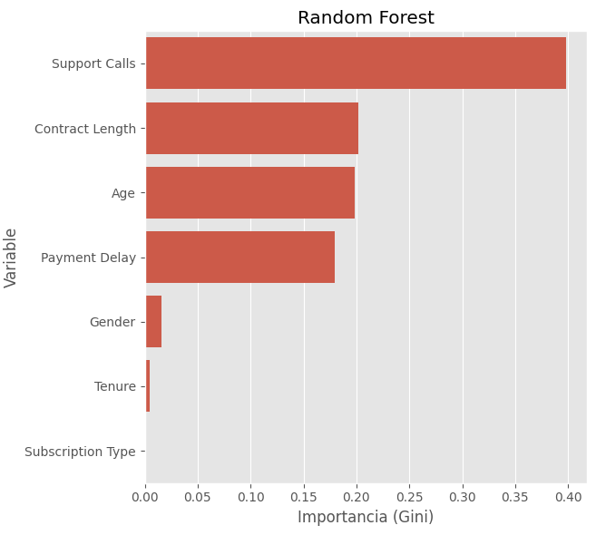

# Churn Prediction 

Proyecto para **predecir la probabilidad de abandono de clientes** (tasa de churn) usando técnicas de **Machine Learning supervisado**. El objetivo es identificar clientes con riesgo de abandonar y tomar acciones preventivas para mejorar la retención.

---

## Descripción del problema

En muchos negocios, el **abandono de clientes** tiene un impacto directo en los ingresos y en la estabilidad del negocio. La tasa de churn mide el porcentaje de clientes que dejan de usar el servicio durante un periodo determinado.

El desafío consiste en predecir, a partir de datos históricos y de comportamiento del cliente:

- Si un cliente es probable que abandone (churn = 1) o permanezca (churn = 0).  
- La **probabilidad de abandono** para cada cliente, no solo una predicción binaria.  

Contamos con información histórica sobre clientes, incluyendo:

- Datos demográficos: edad, género, segmento, antigüedad.  
- Datos de uso: frecuencia de compra/uso, tickets promedio, productos contratados.  
- Interacciones con el servicio: quejas, llamadas a soporte, pagos atrasados.

---

## Inicio rápido

### Prerequisitos

- **Python ≥ 3.11**
- **pip** o **uv** para gestión de dependencias

### Instalación

1. **Clona el repositorio:**
   ```bash
   git clone https://github.com/cacelass/tasa_churn
   cd tasa_churn
   ```

2. **Instala las dependencias:**
   
   Con `pip`:
   ```bash
   pip install -e .
   ```
   
   O con `uv` (recomendado):
   ```bash
   make setup
   ```

3. **Prepara los datos:**
   
   Coloca tu archivo de datos de entrenamiento en la carpeta `data/raw/` con el nombre:
   ```
   data/raw/customer_churn_dataset-training-master.csv
   ```
   
   El archivo debe contener la columna `Churn` con los valores objetivo (0 = no abandona, 1 = abandona).

### Ejecución

**Ejecuta el programa principal:**

```bash
python main.py
```

El programa realizará automáticamente:

1. **Entrenamiento inicial** (solo la primera vez):
   - Carga los datos desde `data/raw/`
   - Preprocesa las características (encoding y escalado)
   - Entrena múltiples modelos (RandomForest, LogisticRegression, etc.)
   - Guarda el mejor modelo en `models/`
   - Guarda los artefactos necesarios (encoders, scaler) en `models/artifacts/`

2. **Modo predicción** (en ejecuciones posteriores):
   - Carga el modelo ya entrenado
   - Solicita datos del cliente de forma interactiva
   - Valida que los datos sean correctos
   - Predice la probabilidad de churn
   - Permite evaluar múltiples clientes en la misma sesión

### Ejemplo de uso

```bash
$ python main.py

>>> Modelo no encontrado. Iniciando entrenamiento...
--> Preprocesando datos de entrenamiento...
>>> Entrenamiento finalizado.

========================================
   RIESGO DE CHURN - PREDICCIÓN
========================================

🔹 Dato: AGE
     Introduce un número: 35

🔹 Dato: GENDER
   Opciones válidas: Female, Male
     Escribe una opción: Male

🔹 Dato: TENURE
     Introduce un número: 24

🔹 Dato: SUBSCRIPTION TYPE
   Opciones válidas: Basic, Standard, Premium
     Escribe una opción: Premium

🔹 Dato: CONTRACT LENGTH
   Opciones válidas: Monthly, Quarterly, Annual
     Escribe una opción: Annual

🔹 Dato: SUPPORT CALLS
     Introduce un número: 2

🔹 Dato: PAYMENT DELAY
     Introduce un número: 0

------------------------------
Cliente estable (Riesgo bajo - Confianza NO churn: 87.3%)
------------------------------

¿Evaluar otro cliente? (s/n): n
Cerrando programa...
```

---

## Estructura del proyecto

```
tasa_churn/
├── data/
│   ├── raw/                          # Datos originales sin modificar
│   │   ├── customer_churn_dataset-training-master.csv
│   │   └── customer_churn_dataset-testing-master.csv
│   ├── interim/                      # Datos intermedios transformados
│   ├── processed/                    # Datos finales para modelos
│   └── external/                     # Datos de fuentes externas
│
├── models/                           # Modelos y artefactos
│   ├── RandomForest.joblib          # Modelo entrenado
│   └── artifacts/                    # Encoders, scalers y configuración
│       ├── encoders.joblib
│       ├── scaler.joblib
│       └── columns.joblib
│
├── notebooks/                        # Jupyter notebooks para exploración
│
├── reports/                          # Reportes y visualizaciones
│   └── figures/
│
├── tests/                            # Tests unitarios
│
├── tasa_churn/                       # Código fuente del proyecto
│   ├── data/
│   │   └── make_dataset.py          # Carga de datos
│   ├── features/
│   │   └── build_features.py        # Preprocesamiento y transformación
│   ├── models/
│   │   ├── train_model.py           # Entrenamiento de modelos
│   │   └── predict_model.py         # Evaluación y predicción
│   ├── utils/
│   │   └── paths.py                 # Gestión de rutas
│   └── visualization/
│       └── visualize.py             # Visualizaciones
│
├── main.py                          # 🚀 Punto de entrada principal
├── pyproject.toml                   # Dependencias del proyecto
├── setup.py                         # Configuración de instalación
└── README.md                        # Este archivo
```

---

## Solución propuesta

El enfoque principal es **aprendizaje supervisado**, donde entrenamos modelos con datos etiquetados (clientes que han abandonado o permanecido) para que aprendan patrones predictivos.  

### Modelos considerados

Para evaluar y seleccionar el mejor modelo, se probarán distintos algoritmos supervisados:

- **Logistic Regression:** proporciona probabilidades explícitas y sirve como baseline.  
- **Decision Tree:** captura relaciones no lineales entre variables y es interpretable.  
- **Random Forest:** ensemble robusto que reduce overfitting y mejora precisión.  
- **K-Nearest Neighbors (KNN):** modelo simple basado en similitud entre clientes.  

### Métricas de evaluación

- **Clasificación binaria:** Accuracy, Precision, Recall, F1-score.  
- **Probabilidades de churn:** ROC-AUC, Log Loss o Brier Score para evaluar la calidad de las probabilidades.  

## Resultados del Modelo

Después de evaluar varios algoritmos (Logistic Regression, Random Forest, XGBoost), estos son los resultados obtenidos con el modelo final:

| Métrica       | Valor  | Descripción |
| :------------ | :----: | :---------- |
| **Accuracy** | 0.81   | Precisión global del modelo. |
| **Precision** | 0.65   | Capacidad de no marcar como fuga a un cliente leal. |
| **Recall** | 0.72   | Capacidad de detectar a los clientes que realmente se van. |
| **F1-Score** | 0.68   | Balance entre precisión y recall. |
| **AUC-ROC** | 0.84   | Capacidad de distinción entre clases. |

> **Nota:** Se priorizó el **Recall** para asegurar que el departamento de retención identifique a la mayor cantidad posible de clientes en riesgo.

### Visualización Clave

---

## Pipeline del proyecto

1. **Exploración de datos:** análisis de distribuciones, valores faltantes y correlaciones (`pandas`, `seaborn`, `missingno`).  
2. **Preprocesamiento:** limpieza, codificación de variables categóricas, escalado de features, imputación de faltantes.  
3. **División train/test** y validación cruzada para asegurar robustez.  
4. **Entrenamiento de modelos supervisados** y comparación de desempeño.  
5. **Selección del modelo final** según métricas y calibración de probabilidades.  
6. **Interpretación de resultados:** importancia de features, identificación de clientes con alto riesgo de churn.  

---

## Tecnologías y librerías

- **Python ≥ 3.11**  
- **Análisis y visualización de datos:** `pandas`, `numpy`, `matplotlib`, `seaborn`, `plotly`  
- **Machine Learning:** `scikit-learn`, `lightgbm`, `xgboost`, `keras`, `tensorflow`  
- **Exploración de datos faltantes y limpieza:** `pyjanitor`, `missingno`  
