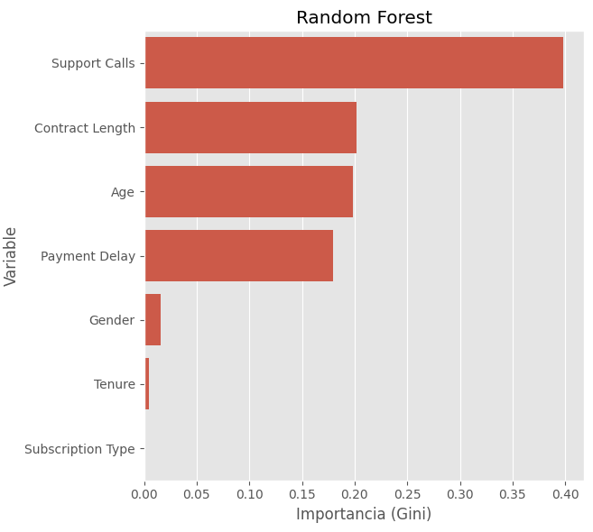

# RETAINML


Sistema de machine learning supervisado que predice la probabilidad de abandono
de un cliente. A partir de datos históricos sobre demografía, patrones de uso e
interacciones con el servicio, el modelo devuelve una puntuación de riesgo y una
etiqueta binaria para que los equipos de retención puedan priorizar a los
clientes en riesgo antes de que se marchen.

---

## Descripción del problema

El abandono de clientes erosiona directamente los ingresos y eleva los costes de
adquisición. El objetivo es aprender de registros históricos etiquetados —
clientes que permanecieron (churn = 0) o se fueron (churn = 1) — y generalizar
a nuevos clientes no vistos.

El sistema predice dos cosas:

- Una etiqueta binaria: ¿abandonará este cliente?
- Una probabilidad: ¿con qué confianza lo afirma el modelo?

Las variables de entrada cubren tres dominios:

- **Demografía** — edad, género, segmento de cliente, antigüedad.
- **Uso** — frecuencia de compra, gasto medio, número de productos activos.
- **Interacciones con el servicio** — llamadas a soporte, reclamaciones, retrasos en pagos.

---

## Resultados

| Métrica | Valor | Descripción |
|---|---|---|
| Accuracy | 0.81 | Porcentaje global de clasificaciones correctas |
| Precision | 0.65 | Evita marcar como fuga a clientes leales |
| Recall | 0.72 | Detecta la mayoría de los clientes que realmente se van |
| F1-Score | 0.68 | Media armónica entre precision y recall |
| AUC-ROC | **0.84** | Mejor indicador global de calidad del modelo |

Las tres variables más predictivas son **tenure**, **payment_delay** y
**subscription_type**. Los clientes con retrasos de pago frecuentes y contratos
más cortos presentan mayor riesgo de abandono, lo que se alinea con la intuición
de negocio.



---

## Inicio rápido

### Prerrequisitos

- Python 3.11 o superior
- `pip` o `uv`

### Instalación

```bash
git clone https://github.com/cacelass/tasa_churn
cd tasa_churn
pip install -e .
```

Con `uv` (más rápido):

```bash
make setup
```

### Ejecución

```bash
python main.py
```

En la primera ejecución el modelo se entrena automáticamente. Las ejecuciones
posteriores omiten el entrenamiento y cargan el modelo guardado directamente.

### Ejemplo de sesión

```
INFO | Modelo encontrado. Omitiendo entrenamiento.
INFO | Modelo cargado: RandomForest.joblib

==========================================
   PREDICCION DE RIESGO DE CHURN
==========================================

  AGE
  > 35

  GENDER
  Opciones: Female, Male
  > Male

  TENURE
  > 24

  SUBSCRIPTION TYPE
  Opciones: Basic, Standard, Premium
  > Premium

  CONTRACT LENGTH
  Opciones: Monthly, Quarterly, Annual
  > Annual

  SUPPORT CALLS
  > 2

  PAYMENT DELAY
  > 0

------------------------------------------
  RIESGO BAJO — cliente estable  (confianza: 87.3%)
------------------------------------------

¿Evaluar otro cliente? (s/n): n
INFO | Sesion cerrada.
```

---

## Estructura del proyecto

```
tasa_churn/
├── .github/
│   └── workflows/
│       └── ci.yml                # Pipeline de CI con GitHub Actions
├── data/
│   ├── raw/                      # Datos originales sin modificar
│   ├── interim/                  # Datos intermedios transformados
│   ├── processed/                # Datos finales listos para modelar
│   └── external/                 # Datos de fuentes externas
├── models/
│   ├── best_model.txt            # Nombre del mejor modelo del último entrenamiento
│   ├── RandomForest.joblib       # Ejemplo de modelo entrenado
│   └── artifacts/
│       ├── encoders.joblib       # Encoders ajustados
│       ├── scaler.joblib         # Scaler ajustado
│       └── columns.joblib        # Orden de columnas del entrenamiento
├── notebooks/                    # Análisis exploratorio y experimentos
├── reports/
│   └── figures/                  # Gráficos y visualizaciones generadas
├── tests/
│   └── test_smoke.py             # Comprobaciones de importación y rutas
├── tasa_churn/                   # Paquete principal
│   ├── data/
│   │   └── make_dataset.py       # Carga de datos
│   ├── features/
│   │   └── build_features.py     # Preprocesamiento e ingeniería de variables
│   ├── models/
│   │   ├── train_model.py        # Bucle de entrenamiento y comparación de modelos
│   │   └── predict_model.py      # Evaluación e inferencia
│   ├── utils/
│   │   └── paths.py              # Definición centralizada de rutas
│   └── visualization/
│       └── visualize.py          # Generación de gráficos
├── main.py                       # Punto de entrada
├── pyproject.toml                # Metadatos del proyecto y dependencias
└── README.md
```

---

## Modelos evaluados

| Modelo | Notas |
|---|---|
| Logistic Regression | Baseline; probabilidades calibradas |
| Decision Tree | Interpretable; captura divisiones no lineales |
| Random Forest | Mejor rendimiento; robusto frente al overfitting |
| K-Nearest Neighbours | Basado en similitud; sensible al escalado |

El mejor modelo según AUC-ROC se guarda automáticamente y se carga en ejecuciones posteriores.

---

## Pipeline

1. **Exploración de datos** — distribuciones, valores faltantes, correlaciones (`pandas`, `seaborn`, `missingno`).
2. **Preprocesamiento** — codificación de variables categóricas, escalado de features, imputación de faltantes.
3. **División train / test** con estratificación y validación cruzada.
4. **Entrenamiento y comparación** de cuatro algoritmos supervisados.
5. **Selección del mejor modelo** por AUC-ROC; persistido en `models/`.
6. **Inferencia** — CLI interactivo que valida entradas y devuelve una probabilidad de abandono.

---

## Tecnologías

| Capa | Librerías |
|---|---|
| Datos | `pandas`, `numpy`, `pyjanitor`, `missingno` |
| Visualización | `matplotlib`, `seaborn`, `plotly` |
| Machine learning | `scikit-learn`, `lightgbm`, `xgboost` |
| Serialización | `joblib` |
| Tests | `pytest` |
| Herramientas | `black`, `pylint`, `uv` |

---

## Desarrollo

```bash
# Instalar con extras de desarrollo
pip install -e ".[dev]"

# Ejecutar tests
pytest tests/ -v

# Formatear código
black .
```

---

## Licencia

MIT — consulta el archivo [LICENSE](LICENSE) para más detalles.V